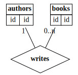

# Introduction

The packages allows you to programmatically create ER diagrams.
The pacakges is simple, but it should help you generate ER diagrams like the one provided by Chen.

# Installation

```
pip install yaerrrr
```

# Example

A single ER can be generated as follows:

```
from yaerrrr.AbstarctYaerrrrScript import AbstractYaerrrrScript


class TestEr(AbstractYaerrrrScript):

    def generate_er(self, context: 'models.YaerrrContext') -> "models.ErDiagram":
        er = context.er

        er.add_entity(name="authors", fields=[
            er.generate_primary_id_key(),
        ])
        er.add_entity(name="books", fields=[
            er.generate_primary_id_key()
        ])
        er.add_1_to_0_n("authors", "books", "writes")

        return er


def main():
    x = TestEr()
    x.run("output.svg")


if __name__ == "__main__":
    main()

```

and it outputs (for now):

